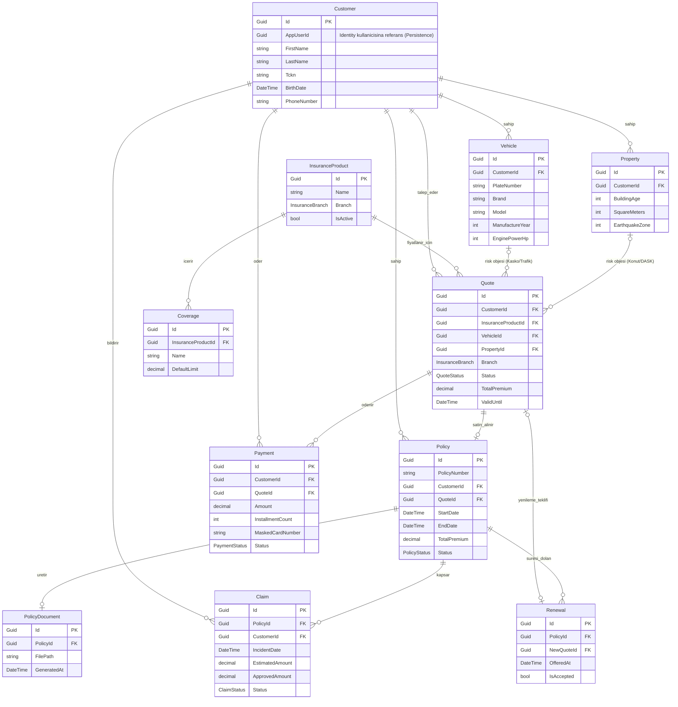

# SigortaPro — Mimari Doküman

## Katman Yapısı (Clean Architecture)

```
┌──────────────────────────────────────────────────────────────┐
│                    Presentation (WebAPI)                      │
│  Controllers, Middleware, Filters, DI Composition Root       │
├──────────────────────────────────────────────────────────────┤
│                    Infrastructure                             │
│  EF Core, SQL Server, JWT, PDF, Mock Services, Background    │
│  ┌─────────────────────┐  ┌──────────────────────────────┐  │
│  │   Persistence       │  │   Infrastructure              │  │
│  │   (DbContext, Repo) │  │   (Token, Pricing, POS, PDF) │  │
│  └─────────────────────┘  └──────────────────────────────┘  │
├──────────────────────────────────────────────────────────────┤
│                    Application (Core)                         │
│  CQRS Handlers, DTOs, Validators, Interfaces, Behaviors      │
├──────────────────────────────────────────────────────────────┤
│                    Domain (Core)                              │
│  Entities, Enums, Value Objects, Domain Events, Constants    │
└──────────────────────────────────────────────────────────────┘
```

**Bağımlılık yönü:** dıştan içe. `Domain` hiçbir şeye bağımlı değildir (sıfır NuGet paketi); `Application` yalnızca `Domain`'e bağımlıdır; `Persistence` ve `Infrastructure` ikisi de `Domain` + `Application`'a bağımlıdır ve birbirlerini referans almazlar; `WebAPI` composition root olarak tüm katmanları bir araya getirir.

## Solution Yapısı

| Proje | Katman | Bağımlılıkları |
|-------|--------|-----------------|
| `SigortaPro.Domain` | Core | — (sıfır bağımlılık) |
| `SigortaPro.Application` | Core | `Domain` |
| `SigortaPro.Persistence` | Infrastructure | `Domain`, `Application` |
| `SigortaPro.Infrastructure` | Infrastructure | `Domain`, `Application` |
| `SigortaPro.WebAPI` | Presentation | `Domain`, `Application`, `Persistence`, `Infrastructure` |

Test projeleri (`tests/`) ilgili katmanla bire bir eşleşir ve yalnızca test ettiği katmana referans verir.

## Build Altyapısı

- **`Directory.Build.props`**: Tüm projeler için ortak derleyici ayarları merkezi olarak tanımlanır — `TargetFramework` (`net8.0`), `Nullable` (enable), `ImplicitUsings` (enable), `LangVersion` (12.0), .NET analyzer'ları (`EnableNETAnalyzers`, `AnalysisLevel=latest-recommended`).
- **`.editorconfig`**: Naming convention'ları (interface `I` prefiksi, private field `_camelCase`, async metot `Async` soneki) analyzer kuralı olarak derleme zamanında uygular; genel formatlama kuralları (girinti, satır sonu, dosya sonu boş satır) tanımlanır.
- **`.gitignore`**: `bin/`, `obj/`, IDE dosyaları, test sonuçları, gizli konfigürasyon dosyaları ve (ileride) `frontend/node_modules` hariç tutulur.

## Katman Detayları

### Domain (`SigortaPro.Domain`)
Entity, enum, domain event ve iş sabitlerini barındırır. Üçüncü parti NuGet paketi (MediatR dahil) içermez; yalnızca .NET BCL tipleri kullanılır. Klasör iskeleti: `Common/`, `Entities/`, `Enums/`, `Events/`, `Constants/`.

Detaylı domain modeli için bkz. [Domain Modeli](#domain-modeli) bölümü.

### Application (`SigortaPro.Application`)
CQRS handler'ları, DTO'lar, FluentValidation validator'ları, repository/servis arayüzleri ve MediatR pipeline behavior'larını barındırır. Klasör iskeleti: `Common/{Behaviors,Exceptions,Interfaces,Models}/`, `Features/{Modül}/{Commands,Queries,DTOs}/`.

### Persistence (`SigortaPro.Persistence`)
EF Core `AppDbContext`, entity konfigürasyonları, generic repository implementasyonları, migration'lar ve seed verisi. Klasör iskeleti: `Context/`, `Configurations/`, `Repositories/`, `Migrations/`, `Seed/`, `Interceptors/`.

### Infrastructure (`SigortaPro.Infrastructure`)
Domain dışı teknik servisler: JWT token üretimi, mock fiyatlama motoru, mock sanal POS, QuestPDF ile poliçe dokümanı üretimi, mock bildirim servisi, arkaplan işleri. Klasör iskeleti: `Services/`, `BackgroundJobs/`.

### WebAPI (`SigortaPro.WebAPI`)
Controller'lar, middleware, filter'lar ve DI composition root. Klasör iskeleti: `Controllers/v1/`, `Middleware/`, `Filters/`, `Extensions/`.

## Domain Modeli

### Yapı Taşları (`Common/`)

| Tip | Açıklama |
|-----|----------|
| `BaseEntity` | Tüm entity'lerin türediği taban sınıf: `Id`, `CreatedAt`, `UpdatedAt`, `IsDeleted`, `CreatedBy`, `UpdatedBy`. |
| `IAggregateRoot` | Aggregate root işaretleyici — yalnızca bu arayüzü uygulayan entity'ler repository üzerinden doğrudan erişilir (`Coverage` ve `PolicyDocument` birer child entity'dir, aggregate root değildir). |
| `Address` | Değişmez (immutable) value object — `City`, `District`, `Neighborhood`, `PostalCode`. `Customer` ve `Property` tarafından kullanılır. |
| `DomainException` | Entity'lerin durum makinesi/iş kuralı ihlallerinde fırlattığı domain-özel exception. Application katmanı bunu yakalayıp `BusinessRuleException`'a çevirir (bkz. ADR-013). |

### Enum'lar (`Enums/`)

`InsuranceBranch` (Kasko, Trafik, Konut, Dask, Saglik) · `UserRole` (Admin, Personel, Customer — rol adları Task 5'te Identity rollerine seed edilir) · `QuoteStatus` (Draft, Priced, Approved, Purchased, Expired, Rejected) · `PolicyStatus` (Active, Expired, Cancelled) · `ClaimStatus` (Submitted, UnderReview, Approved, Rejected, Paid) · `PaymentStatus` (Pending, Successful, Failed)

### İş Sabitleri (`Constants/BusinessConstants`)

`TcknLength` (11) · `MaxQuoteValidityDays` (7) · `RenewalNoticeWindowDays` (30) · `PolicyNumberPrefix` ("POL") · `MaskedCardVisibleDigits` (4)

### Durum Makineleri

```
Quote:  Draft → Priced → Approved → Purchased
                       ↘ Expired
                       ↘ Rejected

Policy: Active → Expired
        Active → Cancelled

Claim:  Submitted → UnderReview → Approved → Paid
                                ↘ Rejected
```

Geçiş kuralları ilgili entity'nin (`Quote`, `Policy`, `Claim`, `Renewal`, `Payment`) genel metotlarında uygulanır (`MarkAsPriced`, `Approve`, `Purchase`, `Reject`, `Expire`, `Cancel`, `ExpireIfPastEndDate`, `StartReview`, `MarkPaid`, `Accept`, `MarkSuccessful`, `MarkFailed`); geçersiz bir geçiş `DomainException` fırlatır. Bu tasarım, entity'lerin anemic olmasını engeller (bkz. `CLAUDE.md` §10 "Anemic domain model hariç").

### Entity İlişki Diyagramı

> Not: Kimlik (Identity) kullanıcısı Domain modelinin parçası değildir; `Customer.AppUserId`, Persistence katmanındaki `AppUser : IdentityUser<Guid>` kaydına işaret eden düz bir Guid'dir (bkz. ADR-014).



### Kimlik (Identity) Sınırı

Kullanıcı/kimlik kavramı Domain modelinin **dışındadır** (ADR-014):

- `AppUser : IdentityUser<Guid>` sınıfı Task 5'te **Persistence katmanında** (`Persistence/Identity/`) tanımlanır; `AppDbContext`, `IdentityDbContext<AppUser, IdentityRole<Guid>, Guid>`'ten türer.
- Domain'deki `Customer`, kullanıcıya yalnızca `AppUserId` (Guid) değeriyle bağlanır; navigation property yoktur.
- Application katmanı kullanıcı işlemlerine `IIdentityService` soyutlaması üzerinden erişir (arayüz Application'da, implementasyon Persistence'ta — `UserManager<AppUser>` kullanır).
- `ITokenService` (JWT üretimi) primitif değerlerle çalışır ve Infrastructure'da kalır; Infrastructure ↛ Persistence kuralı korunur.
- Refresh token kaydı Identity'nin yanında Persistence'ta tutulur.
- `UserRole` enum'u (Domain) rol adlarının tek kaynağıdır; Task 5'te Identity rollerine seed edilir.

Bu desen, .NET Clean Architecture ekosisteminin fiilî standardıdır (Jason Taylor CleanArchitecture şablonu, Microsoft eShop). Gerekçe ve alternatifler için bkz. ADR-014.

## Application Katmanı — CQRS Omurgası

`SigortaPro.Application`, MediatR (12.x — ADR-015) üzerine kurulu CQRS altyapısını barındırır. Klasör: `Common/{Behaviors,Exceptions,Interfaces,Models}/`.

### CQRS Marker'ları ve Handler Arayüzleri

`ICommand` / `ICommand<TResponse>` / `IQuery<TResponse>` (hepsi `MediatR.IRequest`'ten türer) ve bunlara karşılık gelen `ICommandHandler<TCommand>` / `ICommandHandler<TCommand, TResponse>` / `IQueryHandler<TQuery, TResponse>` arayüzleri, `IRequestHandler`'ı sarmalayarak Command/Query ayrımını tip sisteminde görünür kılar (ARCHITECTURE_RULES.md §3).

### Pipeline Behavior Zinciri

Kayıt sırası (`ApplicationServiceRegistration.AddApplicationServices`), ARCHITECTURE_RULES.md §3.5'te tanımlanan sırayla birebir eşleşir:

```
Request → ValidationBehavior → LoggingBehavior → PerformanceBehavior → UnhandledExceptionBehavior → Handler
```

- **`ValidationBehavior`** — `IValidator<TRequest>` kayıtlarını çalıştırır; hata varsa `Application.Common.Exceptions.ValidationException` fırlatır.
- **`LoggingBehavior`** — İstek başlangıç/bitişini structured log olarak yazar.
- **`PerformanceBehavior`** — 500ms üzeri süren handler'ları warning seviyesinde loglar.
- **`UnhandledExceptionBehavior`** — Domain'in `DomainException`'ını yakalayıp `BusinessRuleException`'a (409) çevirir (ADR-013); zaten bilinen `SigortaProException` alt tiplerini olduğu gibi yükseltir; beklenmeyen diğer hataları loglayıp yeniden fırlatır (middleware'in 500'e çevirmesi için — Task 6).

### Exception Hiyerarşisi

`SigortaProException` (abstract) → `NotFoundException` (404) · `ValidationException` (400, `IDictionary<string, string[]> Errors`) · `BusinessRuleException` (409) · `ForbiddenAccessException` (403). `PaymentFailedException` (402), CODING_STANDARDS.md §7.1'de öngörülmüştür ancak ödeme akışıyla birlikte Task 10'da eklenecektir.

### Result / PagedResult / PaginationParams

`Result` / `Result<T>` — `IsSuccess`/`IsFailure`/`Errors` ve (generic sürümde) `Value` taşıyan, statik `Success()`/`Failure()` factory'li bir sonuç sarmalayıcısı (CA1000 bilinçli olarak suppress edilmiştir — bkz. kod içi gerekçe). `PagedResult<T>` — `Items`/`Page`/`PageSize`/`TotalCount`/`TotalPages`. `PaginationParams` — `PageSize` varsayılan 20, üst sınır 100 (DEVELOPMENT_RULES.md §6). Bu tipler, hangi command/query'nin bunları kullanacağına ilgili feature task'ında (Task 7+) karar verilecek; Task 3 yalnızca omurgayı kurar.

### Servis Arayüzleri

`ICurrentUserService` (impl. WebAPI, HttpContext tabanlı — Task 6), `IDateTimeProvider` (impl. Infrastructure — Task 6), `IReadRepository<T>` / `IWriteRepository<T>` / `IUnitOfWork` (impl. Persistence — Task 4) burada tanımlanır; tam liste için ARCHITECTURE_RULES.md §6.1.

## Persistence Katmanı — EF Core + SQL Server

`SigortaPro.Persistence`, `AppDbContext` etrafında kurulu EF Core Code-First altyapısını barındırır. Klasör: `Context/`, `Configurations/{Common/}`, `Interceptors/`, `Repositories/`, `Seed/`, `Migrations/`.

### AppDbContext ve Konfigürasyonlar

`AppDbContext`, yalnızca 9 aggregate root'u (`Customer`, `InsuranceProduct`, `Vehicle`, `Property`, `Quote`, `Policy`, `Payment`, `Claim`, `Renewal`) `DbSet<T>` olarak dışa açar; `Coverage` ve `PolicyDocument` kendi `IEntityTypeConfiguration`'larıyla modele dahildir ancak yalnızca sahibi aggregate root'un navigation'ı üzerinden erişilir (ARCHITECTURE_RULES.md §4.2). Tüm konfigürasyonlar ortak bir `BaseEntityConfiguration<T>` taban sınıfından türer; bu taban sınıf `Id`, audit alanları (`CreatedAt`/`CreatedBy`/`UpdatedBy` max 256 karakter) ve soft-delete `HasQueryFilter`'ı merkezi olarak uygular (ADR-010), her entity konfigürasyonu yalnızca kendine özgü kuralları (`ToTable`, `HasMaxLength`, `decimal(18,2)`, index, ilişki) ekler.

Öne çıkan kurallar:
- Para alanları (`TotalPremium`, `Amount`, `DefaultLimit`, `EstimatedAmount`, `ApprovedAmount`) `decimal(18,2)`.
- Benzersiz index'ler: `UQ_Customers_TCKN`, `UQ_Customers_AppUserId`, `UQ_Policies_PolicyNumber`, `UQ_PolicyDocuments_PolicyId`.
- `Address` value object'i (`Customer`, `Property`) `OwnsOne` ile aynı tabloya gömülü kolon (`City`/`District`/`Neighborhood`/`PostalCode`) olarak eşlenir.
- `Customer`'dan başlayan tüm ilişkiler (`Vehicle`, `Property`, `Quote`, `Policy`, `Claim`) `DeleteBehavior.Restrict` kullanır — SQL Server'ın çoklu cascade path kısıtlamasını aşmak için; `Policy → PolicyDocument` tek yönlü olduğundan `Cascade` güvenlidir.

### Repository ve UnitOfWork

`GenericRepository<T>`, Task 3'te tanımlanan `IReadRepository<T>` ve `IWriteRepository<T>`'yi tek sınıfta implement eder (`AsNoTracking` salt-okunur sorgularda, `GetPagedAsync` ile sayfalama). `Delete(T entity)` fiziksel silme yapmaz; `IsDeleted = true` işaretleyip `Update` çağırır (ADR-010). `UnitOfWork`, `AppDbContext.SaveChangesAsync`'i sarmalar.

### Audit Interceptor ve Soft Delete

`AuditableEntityInterceptor` (`SaveChangesInterceptor`), `EntityState.Added`/`Modified` durumundaki tüm `BaseEntity` kayıtlarında audit alanlarını doldurur. `IDateTimeProvider`/`ICurrentUserService` bağımlılıkları **opsiyoneldir** (Task 5/6'da implement edilecek); kayıtlı değillerse sırasıyla `DateTime.UtcNow` ve `null`'a düşer — gerçek implementasyonlar eklendiğinde interceptor'da değişiklik gerekmez (bkz. ADR-016). Soft-delete filtresi (`!IsDeleted`) `BaseEntityConfiguration` üzerinden tüm entity'lerde global olarak uygulanır.

### Migration ve Seed

Tasarım zamanı migration üretimi için `AppDbContextFactory : IDesignTimeDbContextFactory<AppDbContext>` kullanılır (sabit SQL Server Express bağlantısıyla, WebAPI'nin DI container'ından bağımsız — bkz. DEVELOPMENT_RULES.md §5.3, komutlar Persistence projesinden çalıştırılır). `DbSeeder`, idempotent şekilde (ürünler tablosu doluysa atlar) 5 sigorta ürünü + teminatlarını, örnek bir müşteriyi ve örnek araç/teklif/poliçe zincirini (domain'in kendi state-machine metotlarıyla `Draft → Priced → Approved → Purchased`) seed eder. Sabit GUID'ler `Seed/SeedIds.cs`'te tanımlıdır (DEVELOPMENT_RULES.md §5.4); `SeedIds.SampleCustomerAppUserId`, Task 5'te seed edilecek örnek Identity kullanıcısının `Id`'siyle birebir eşleşmelidir.

`Program.cs`, development ortamında `Database.MigrateAsync()` + `DbSeeder.SeedAsync()` çağırır; bağlantı dizesi `appsettings.Development.json`'da yerel SQL Server Express instance'ı (`.\SQLEXPRESS`), `appsettings.json`'da (üretim) boş placeholder'dır — gerçek ortam değeri deployment sırasında sağlanır. Tasarım zamanı (`AppDbContextFactory`) bağlantıyı `SIGORTAPRO_DESIGN_CONNECTION` ortam değişkeninden okur, tanımlı değilse aynı yerel instance'a düşer.

## Kimlik Doğrulama & Yetkilendirme (JWT + Identity)

Task 5 ile ASP.NET Core Identity + JWT tabanlı kimlik doğrulama kuruldu (ADR-003, ADR-014). Katman dağılımı, "kimlik Domain dışıdır" ilkesini korur:

- **Persistence** — `AppUser : IdentityUser<Guid>` ve `RefreshToken` (`Identity/`); `AppDbContext : IdentityDbContext<AppUser, IdentityRole<Guid>, Guid>`. `IIdentityService` (kullanıcı oluşturma/doğrulama, `UserManager<AppUser>` tabanlı) ve `IRefreshTokenService` (refresh token saklama/rotasyon) implementasyonları burada. Identity `AddIdentityCore` + EF store'larıyla kurulur (cookie yok). `IdentitySeeder` rolleri, admin ve örnek müşteri kullanıcısını idempotent seed eder.
- **Infrastructure** — `ITokenService` implementasyonu `TokenService`: HS256 imzalı JWT access token (15 dk) + kriptografik rastgele refresh token (7 gün) üretir; `JwtSettings` konfigürasyonuyla çalışır ve yalnızca primitif değerler kullandığı için Persistence'a bağımlı değildir (Infrastructure ↛ Persistence korunur).
- **Application** — `IIdentityService` / `ITokenService` / `IRefreshTokenService` arayüzleri, `Features/Auth/` altında `Register` / `Login` / `RefreshToken` command + handler + validator'ları, `AuthResponse` DTO'su. Rol adları `Common/Authorization/Roles` sabitlerinde `UserRole` enum'undan türetilir. Beklenen auth hataları (yanlış kimlik → 401, duplicate e-posta → 409) `Result<AuthResponse>` ile taşınır. Ortak `TcknValidation` (algoritmik TCKN doğrulaması) burada tanımlıdır (Task 7 de kullanacak).
- **WebAPI** — `AuthController` (`api/v1/auth/{register,login,refresh-token}`), JWT bearer authentication + authorization pipeline (`ServiceCollectionExtensions.AddWebApiServices`), `ICurrentUserService` (HttpContext tabanlı — kaynak sahipliği ve audit için). `Program.cs` composition root tüm katman DI kayıtlarını birleştirir ve development ortamında migration + `DbSeeder` + `IdentitySeeder` çağırır.

**Kayıt atomikliği (ADR-017):** `RegisterCommandHandler`, Identity kullanıcısı + Domain `Customer` kaydını `IUnitOfWork.ExecuteInTransactionAsync` ile tek transaction'da oluşturur; biri başarısız olursa ikisi de geri alınır.

## API Çapraz Kesit Altyapısı (Cross-Cutting)

Task 6, prodüksiyon standardında bir API kabuğu kurar. Tüm bileşenler `SigortaPro.WebAPI` altında `Middleware/`, `Extensions/`, `HealthChecks/` klasörlerinde toplanır; DI ve pipeline kurulumu `ServiceCollectionExtensions` / `ApplicationBuilderExtensions` üzerinden merkezîdir.

### HTTP Pipeline Sırası

```
CorrelationId → SecurityHeaders → SerilogRequestLogging → ExceptionHandling
  → [Swagger (dev) | HSTS (prod)] → HttpsRedirection → Routing → CORS
  → RateLimiter → Authentication → Authorization → Controllers + /health
```

### Bileşenler

- **Global Exception Handling** (`ExceptionHandlingMiddleware`) — `SigortaProException` hiyerarşisini RFC 7807 `ProblemDetails`'e eşler: `ValidationException`→400 (alan bazlı `errors`), `NotFoundException`→404, `ForbiddenAccessException`→403, `BusinessRuleException`→409, taban tip→400, bilinmeyen→500 (iç detay yalnızca Development'ta açık). Yanıtlara `traceId` + `correlationId` eklenir; `application/problem+json`. `[ApiController]` otomatik model-binding doğrulaması da `InvalidModelStateResponseFactory` ile **aynı zarfa** hizalandı — böylece tüm doğrulama hataları tek formatta döner (ADR-018). Bu, Task 5'teki "middleware gelene kadar 500" boşluğunu kapatır.
- **Serilog** (ADR-011) — console + günlük rolling file (`logs/sigortapro-.log`, 7 gün); yapılandırma `appsettings.json > Serilog` bölümünden (`ReadFrom.Configuration`). Bootstrap logger, host kurulum hatalarını da yakalar (`try/catch/finally` + `Log.CloseAndFlush`). `CorrelationIdMiddleware` her isteğe `X-Correlation-ID` atar (gelen header korunur, yoksa üretilir), `LogContext` ile tüm loglara işler ve yanıt header'ında geri döndürür; `UseSerilogRequestLogging` istek özetini korelasyon kimliğiyle zenginleştirir.
- **CORS** — `Cors:AllowedOrigins` (varsayılan Vite `http://localhost:5173`); credentials + `X-Correlation-ID` expose edilir.
- **API Versiyonlama** — konvansiyon tabanlı URL yaklaşımı (`/api/v1/...`, controller'lar `Controllers/v1/`), harici kütüphane olmadan (ADR-019).
- **Swagger/OpenAPI + JWT** — Swashbuckle 6.6.2 (.NET 8 uyumlu), Bearer güvenlik şeması + XML doc yorumları; yalnızca Development'ta.
- **Health Check** — `GET /health`, JSON yanıt; `DatabaseHealthCheck` EF Core `CanConnectAsync` ile DB'yi yoklar (ek NuGet paketi yok).
- **Rate Limiting & Güvenlik Header'ları** (ADR-020) — yerleşik ASP.NET Core 8 rate limiter: auth uçlarına IP başına 10 istek/dakika (fixed window, aşımda 429). `SecurityHeadersMiddleware` (`OnStarting`): `X-Content-Type-Options`, `X-Frame-Options: DENY`, `Referrer-Policy`, `Permissions-Policy`; HSTS yalnızca üretimde.

## Mimari Kararlar

Tüm önemli mimari kararlar ve gerekçeleri için bkz. [`docs/ai/DECISIONS.md`](docs/ai/DECISIONS.md). Bu doküman kuruluşta ADR-001 (Clean Architecture katman yapısı) kararını uygular; Domain modeli ADR-013 ve ADR-014 kararlarını, Application/CQRS omurgası ADR-002, ADR-013 ve ADR-015 kararlarını, Persistence katmanı ADR-005, ADR-010 ve ADR-016 kararlarını, kimlik doğrulama ADR-003, ADR-014 ve ADR-017 kararlarını, cross-cutting API altyapısı ADR-018 (exception handling/ProblemDetails), ADR-019 (API versiyonlama) ve ADR-020 (rate limiting + güvenlik header'ları) kararlarını uygular (ADR-012, ADR-014 ile revize edilmiştir).

## Durum

Bu doküman **Task 1 — Solution İskeleti**, **Task 2 — Domain Katmanı**, **Task 3 — Application Katmanı Altyapısı (CQRS Çekirdeği)**, **Task 4 — Persistence Katmanı (EF Core + SQL Server)**, **Task 5 — Kimlik Doğrulama & Yetkilendirme (JWT + Roller)** ve **Task 6 — API Çapraz Kesit Altyapısı (Cross-Cutting)** kapsamında oluşturulmuştur. FAZ 0 tamamlanmıştır; sonraki adım FAZ 1 iş modülleridir (Task 7 — Müşteri & Profil Modülü).
